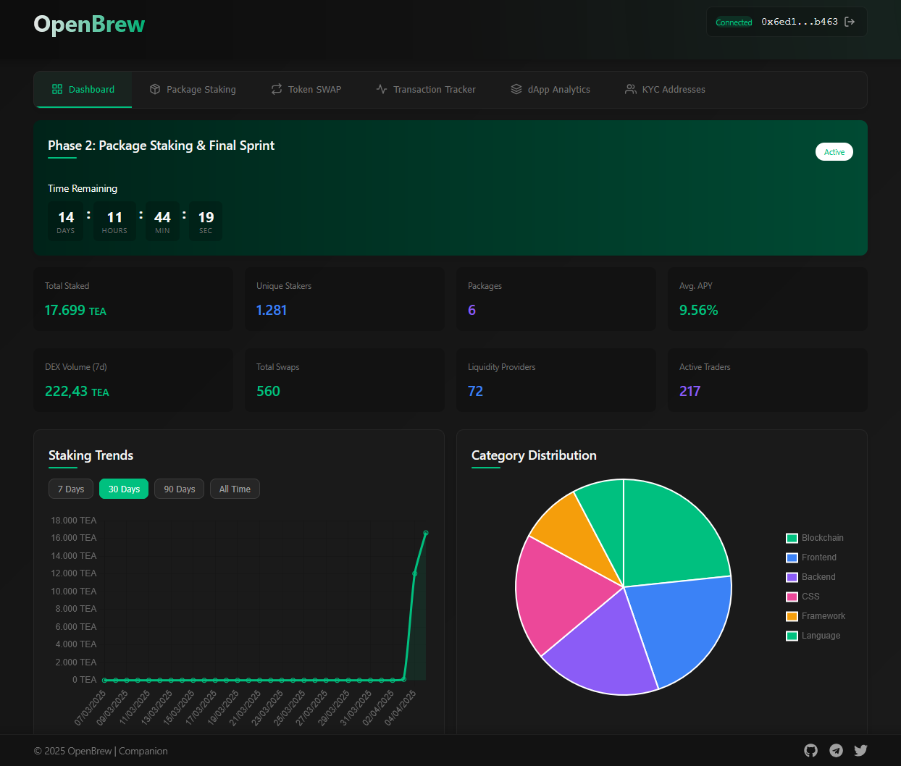

# 🧪 Open Brew — DEX Analytics for TEA Protocol

Open Brew is a decentralized analytics and staking platform built on top of [TEA Protocol](https://www.tea.xyz/). This project aims to provide contributors and users with a clean dashboard to track packages, stake tokens, monitor transactions, and view KYC-verified addresses.

## 🚀 Features

- 📊 Dashboard for package analytics
- 📦 Package Staking System
- 💳 Transaction Tracker
- 🔍 KYC Address Viewer
- 🛠️ Built using Next.js + TailwindCSS

## 🌐 Live Preview

Check it out here: [https://open-brew.vercel.app](https://open-brew.vercel.app)



## 🧪 Testnet Information

Open Brew is currently running on TEA Protocol's testnet environment. This means:

- All transactions are performed on the testnet blockchain
- Test tokens are used instead of real cryptocurrency
- Features and functionalities are being tested before mainnet launch
- Data may be reset during testing phases

To interact with Open Brew on the testnet:
1. Connect using a testnet-compatible wallet
2. Request test tokens from the [TEA Protocol faucet](https://faucet-sepolia.tea.xyz/#/) (or appropriate link)
3. Provide feedback on any issues or bugs you encounter

The testnet version allows users to experience the full functionality of Open Brew without financial risk while we continue to optimize and improve the platform before our mainnet release.

## 📞 Contact

- Telegram: [https://t.me/madsrepo](https://t.me/madsrepo)

## 📁 Folder Structure
```plaintext
open-brew/
├── app/                # Next.js app directory
│   ├── images/         # Contains dashboard images 
│   └── assets/         # Contains other assets
├── components/         # Reusable React components
├── lib/                # API and utility functions
├── pages/              # Route-based components (legacy)
├── public/             # Static files
├── styles/             # Tailwind & global CSS
├── .env.example        # Environment variables template
├── tailwind.config.js  # TailwindCSS configuration
└── README.md