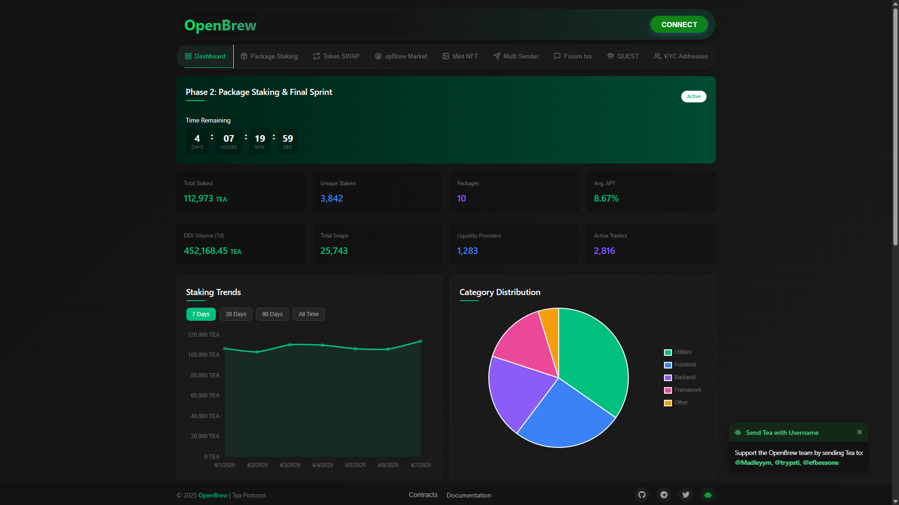

# 🧪 Open Brew — DEX Platform for TEA Protocol

Open Brew is a decentralized exchange (DEX) platform built on top of [TEA Protocol](https://www.tea.xyz/)'s testnet. This project provides users with a clean dashboard interface to interact with various TEA ecosystem services, including package staking, token swapping, trading, and more. Open Brew brings together essential DeFi functionality in one place, allowing users to seamlessly participate in the TEA ecosystem through features like NFT minting, multi-sender transactions, forum interactions, and KYC address verification.

## 🚀 Features

- 📊 Dashboard for protocol overview
- 📦 Package Staking System for open-source packages
- 💱 Token SWAP functionality
- 📈 Trading capabilities
- 🏪 opBrew Market
- 🖼️ Mint NFT
- 📨 Multi Sender utility
- 💬 Forum transactions
- 👥 KYC Addresses verification
- 🛠️ Built using Next.js + TailwindCSS

## 🌐 Live Preview

Check it out here: [https://open-brew.vercel.app](https://open-brew.vercel.app)

## 💼 Smart Contract Details

### Core Protocol Contracts

| Contract Name | Type | Address |
|---------------|------|---------|
| OpenBrew DEX | DEX | [`0xC6200C2eb0efB83602a40aCaa842Cc1E3e06190C`](https://sepolia.tea.xyz/address/0xC6200C2eb0efB83602a40aCaa842Cc1E3e06190C?tab=contract) |
| OpenBrewPackageStaker | Staking | [`0x64B13eD4Af86Bc8CdF741A1a1291b5baE0DD14aF`](https://sepolia.tea.xyz/address/0x64B13eD4Af86Bc8CdF741A1a1291b5baE0DD14aF?tab=contract) |
| Quest Contract | Contract | [`0xe2124e251346e10a2f1095561A96AF52C6f182d0`](https://sepolia.tea.xyz/address/0xe2124e251346e10a2f1095561A96AF52C6f182d0?tab=contract) |
| OpenBrew Sender | Transfer | [`0x69eb499c045b9931ad8732a46f820400c1bee235`](https://sepolia.tea.xyz/address/0x69eb499c045b9931ad8732a46f820400c1bee235?tab=contract) |
| OpenBrewForumTEA | Forum | [`0x085bd9c4b9a6026125b0373382c37cda6d0bd19a`](https://sepolia.tea.xyz/address/0x085bd9c4b9a6026125b0373382c37cda6d0bd19a?tab=contract) |

### Tokens

| Token Name | Standard | Address |
|------------|----------|---------|
| BREW Token | ERC-20 | [`0x6C535Fd8aab652dD5284e3568208EF9FdCd21232`](https://sepolia.tea.xyz/address/0x6C535Fd8aab652dD5284e3568208EF9FdCd21232?tab=contract) |
| Brew WTEA (WTEA) | ERC-20 | [`0x04dF97d2565C3821B6b3a56fCD405084f0239324`](https://sepolia.tea.xyz/address/0x04dF97d2565C3821B6b3a56fCD405084f0239324?tab=contract) |
| opBREW Token | ERC-20 | [`0x97EC8BcB2c8dA0b119A5263798bB5dB332C917Fb`](https://sepolia.tea.xyz/address/0x97EC8BcB2c8dA0b119A5263798bB5dB332C917Fb?tab=contract) |
| TEA Protocol Leaf NFTs | ERC-721 | [`0x1dC5474E984A29e2B7835B6045465bD5a4D58DfE`](https://sepolia.tea.xyz/address/0x1dC5474E984A29e2B7835B6045465bD5a4D58DfE?tab=contract) |

### Legacy Contracts

| Contract Name | Type | Address |
|---------------|------|---------|
| Old Staking Contract | Legacy | [`0xbba4121A3bDE406Be131257C8918F67c97789166`](https://sepolia.tea.xyz/address/0xbba4121A3bDE406Be131257C8918F67c97789166?tab=contract) |

## 🧪 Testnet Information

Open Brew is currently running on TEA Protocol's testnet environment. This means:

- All transactions are performed on the testnet blockchain
- Test tokens are used instead of real cryptocurrency
- Features and functionalities are being tested before mainnet launch
- Data may be reset during testing phases

To interact with Open Brew on the testnet:
1. Connect using a testnet-compatible wallet
2. Request test tokens from the [TEA Protocol faucet](https://faucet-sepolia.tea.xyz/#/)
3. Provide feedback on any issues or bugs you encounter

The testnet version allows users to experience the full functionality of Open Brew without financial risk while we continue to optimize and improve the platform before our mainnet release.

## 📞 Contact

- Telegram: [https://t.me/madsrepo](https://t.me/madsrepo)